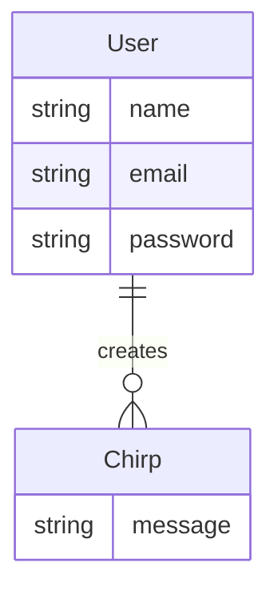

# Chirper TDD

*How to build a Laravel app using TDD that won't hurt you in the future*.

This is a highly opinionated guide on test-driven Laravel application development that I use for my personal and client projects. For any comments, issues, thoughts and general feedback feel free to open an issue or PR on [github](https://github.com/nikfedorov/chirper-tdd).

As an example we're going to build a microblogging platform called Chirper. You might've seen it on [Laravel Bootcamp](https://bootcamp.laravel.com/). For the sake of simplicity we're going to rebuild this one with Blade templating engine.

## Usage

Here's a short guide on how to install this project and try it out locally. To check the development guide move to next section.

### Installation

After cloning the repository run the command:

```sh
./install.sh
```

It will accomplish the following:
- install composer dependencies
- build application containers
- migrate and seed the database with fake data
- build frontend

To delete existing volumes and rebuild containers add a `--rebuild` flag:

```shell
./install.sh --rebuild
```

### Usage and development

Run composer dev script in the separate terminal window:

```shell
./vendor/bin/sail composer dev
```

Now you can access the application at http://localhost

To login you should register a new user and verify your email that will be caught by Mailpit at http://localhost:8025

Alternatively you can use the following credentials to login:

```env
login: test@example.com
password: password
```

Once you create a new Chirp every existing user will receive an email notification. Which once again will be caught by Mailpit.

After you created some code make sure to run:

```shell
./vendor/bin/sail composer check
```

This script accomplishes the following:

- format code with Laravel Pint
- run the test suite demanding 100% coverage
- perform static code analysis with Larastan
- check code style with PHP Insights

Make sure to clear all aroused issues before submitting the PR, as the same checks are mandatory for a PR to be merged.

## 0. Planning

To develop Chirper application we need to define general requirements.

Chirper should have the following features:
- user can login, register, reset password
- user can get a list of Chirps
- user can create a Chirp
- user can update a Chirp
- user can delete a Chirp
- user can receive a notification on new Chirps

Here's a simple diagram of database relations.



Notifications should be sent asynchronously.

## 1. Installation

Before creating a Laravel application you should have PHP, Composer and the Laravel Installer installed. If you don't have any of those please refer to the [official documentation](https://laravel.com/docs/12.x/installation#creating-a-laravel-project). 

You should also have Git. If for some reason you don't you might be reading the wrong guide.

Once you have all of the above installed it's time to create a new Laravel application. Installer will prompt you to select your preferred starter kit, database, and will also try to run npm scripts. For the simplest setup choose the following:
- Starter kit? -> None
- Database? -> SQLite
- Run npm install? -> No

```bash
laravel new chirper-tdd
```

Now let's dive into the new project and initialize a git repository:

```shell
cd chirper-tdd
git init
```

Now let's commit all newly created files, create `develop` branch and a branch for further installation stuff:

```bash
git add -A && git commit -m 'Initial commit'
git branch develop
git checkout -b feature/installation
```

### Dockerize

In order to perform regardless of the OS we're going to utilize a docker-based Laravel setup using [Laravel Sail](https://laravel.com/docs/sail). To reach everything we planned we need a database, a service for queued jobs and some place to catch outgoing emails.

In order to keep consisten with this guide please select `pgsql`, `redis` and  `mailpit`:

```bash
php artisan sail:install
./vendor/bin/sail up -d
```

To run Sail commands you have to constantly type the full path to `./vendor/bin/sail` script. In order to avoid this we'll set up a shell alias as described in [the docs](https://laravel.com/docs/sail#configuring-a-shell-alias).

```bash
alias sail='sh $([ -f sail ] && echo sail || echo vendor/bin/sail)'
```

Let's commit this step:

```bash
git add -A && git commit -m 'feat: dockerize'
```

### Environment variables

Laravel Sail install script made some changes in your `.env` so that now it differs from `.env.example`. You don't want to lose them since you don't push your `.env` to source control so make sure to adjust your `.env.example`.

To do this you can simply copy the contents of `.env` into `.env.example`. But make sure to keep your `APP_KEY` empty.

Also this might be a good time to set your application name.

```env
APP_NAME="Chirper TDD"

LOG_STACK=daily

DB_CONNECTION=pgsql
DB_HOST=pgsql
DB_PORT=5432
DB_DATABASE=laravel
DB_USERNAME=sail
DB_PASSWORD=password

SESSION_DRIVER=redis
QUEUE_CONNECTION=redis
CACHE_STORE=redis

REDIS_HOST=redis

MAIL_MAILER=smtp
MAIL_HOST=mailpit
MAIL_PORT=1025
```

Notice that we also set `SESSION_DRIVER`, `QUEUE_CONNECTION` and `CACHE_STORE` to `redis` since now we have redis installed.

Let's commit this step:

```bash
git add -A && git commit -m 'feat: update environment variables'
```

### Install script

If someone clones this project for the first time, none of the application's composer dependencies, including sail, will be installed. Therefore we need a script to help accomplish this.

Create `install.sh` file in you project root:

```bash
touch install.sh
```

And fill it with the following:

```sh
#!/bin/bash

bold=$(tput bold)
normal=$(tput sgr0)

if [[ $1 == "--rebuild" ]]; then
    vendor/bin/sail down -v --remove-orphans
fi

if [ ! -f ./.env ]; then
    echo -e "\n${bold}> cp ./.env.example ./.env${normal}"
    cp ./.env.example ./.env
fi

echo -e "\n${bold}> composer install${normal}"
docker run --rm \
    -u "$(id -u):$(id -g)" \
    -v "$(pwd):/var/www/html" \
    -w /var/www/html \
    laravelsail/php84-composer:latest \
    composer install --ignore-platform-reqs

echo -e "\n${bold}> sail build${normal}"
vendor/bin/sail build

echo -e "\n${bold}> sail up -d${normal}"
vendor/bin/sail up -d

source .env
if [ "$APP_KEY" == "" ]; then
    echo -e "\n${bold}> sail artisan key:generate${normal}"
    vendor/bin/sail artisan key:generate
fi

echo -e "\n${bold}> sail artisan migrate:fresh --seed${normal}"
vendor/bin/sail artisan migrate:fresh --seed --force --no-interaction

echo -e "\n${bold}> sail npm install${normal}"
vendor/bin/sail npm install

echo -e "\n${bold}> sail npm run build${normal}"
vendor/bin/sail npm run build

echo -e "\n${bold}Done!${normal}"
echo -e "You can now access your project at http://localhost"
echo -e "\nDon't forget to run the command for all your development needs:"
echo -e "${bold}sail composer dev${normal}"
```

Make this script executable:

```sh
chmod +x install.sh
```

And now you can run it by simply typing:

```sh
./install.sh
```

To remove volumes and rebuild everything you can use:

```sh
./install.sh --rebuild
```

Here you might get an error of failed connection to the database. It happened because the default docker-compose setup doesn't really care about health of your containers. To fix this open your `docker-compose.yml` and replace `depends_on` section of `laravel.test` with the following:

```yml
depends_on:
    pgsql:
        condition: service_healthy
    redis:
        condition: service_healthy
    mailpit:
        condition: service_started
```

Finally to make health checks go faster add the following configurations to `healthcheck` sections of `pgsql` and `redis`:

```yml
retries: 5
timeout: 3s
interval: 5s
```

Let's commit this step:

```bash
git add -A && git commit -m 'feat: create install script'
```

### Dev packages

To avoid multiple composer runs in this guide we're going to install everything we need at once.

```bash
sail composer remove --dev phpunit/phpunit 
sail composer require --dev pestphp/pest-plugin-laravel \
    spatie/phpunit-watcher \
    larastan/larastan \
    nunomaduro/phpinsights \
    laravel/breeze
```

Let's commit this step:

```bash
git add -A && git commit -m 'feat: install dev packages'
```

### Setup

Laravel has a handy function to prevent n+1 issues and strictly work with existing model attributes only. Add the following to your `Provides/AppServiceProvider`:

```php
use Illuminate\Database\Eloquent\Model;

public function boot(): void
{
    Model::shouldBeStrict();
}
```

Laravel also has a script in `composer.json` to run all background tasks at once. By default it starts a http server, a queue worker, log catcher and a npm dev server. Since we already have a http server running you can remove it from the script like this:

```json
"dev": [
    "Composer\\Config::disableProcessTimeout",
    "npx concurrently -c \"#c4b5fd,#fb7185,#fdba74\" \"php artisan queue:listen --tries=1\" \"php artisan pail --timeout=0\" \"npm run dev\" --names=queue,logs,vite"
],
```

Now open a separate console and keep the script running all the time you're working on the project:

```bash
sail composer dev
```

Let's commit this step and merge current branch into `develop`:

```bash
git add -A && git commit -m 'feat: models are strict, adjust composer dev script'
git checkout develop
git merge feature/installation --no-ff --no-edit
git branch -d feature/installation
```

## 2. Auto checks

To keep our codebase clean and shiny we're going to use tests, static analysis and code style tools. We'll also use a test watcher to avoid constantly restarting tests.

Let's create a branch for this section:

```bash
git checkout -b feature/auto-checks
```

### Code style

Laravel has [Laravel Pint](https://laravel.com/docs/pint) package installed which is just a wrapper around PHP-CS-Fixer. Create `pint.json` in your project root.

```bash
touch pint.json
```

And fill it with the following:

```json
{
    "preset": "laravel",
    "rules": {
        "new_with_braces": {
            "anonymous_class": false,
            "named_class": true
        },
        "single_line_empty_body": false,
        "strict_comparison": true
    }
}
```

Run it and see how it has nothing to fix on a fresh project.

```bash
sail php ./vendor/bin/pint
```

Let's commit this step:

```bash
git add -A && git commit -m 'feat: configure laravel pint'
```

### Pest

For test-driven workflow we need a testing framework. Laravel already has PHPUnit built in, but we replaced it with [PestPHP](https://pestphp.com/) from [Nuno Maduro](https://github.com/nunomaduro).

To initialize pest run the following command:

```bash
rm phpunit.xml \
    tests/TestCase.php \
    tests/Unit/ExampleTest.php \
    tests/Feature/ExampleTest.php
sail php ./vendor/bin/pest --init
```

Let's run the testsuite with coverage report. Note that Laravel Sail actually has an xDebug installed and set up so you don't have to do anything by your own.

```bash
sail test --coverage --coverage-html=coverage
```

To avoid html coverage report being committed to the repository add the following line to `.gitignore` file in your project root:

```
/coverage
```

Personally I prefer to run tests on sqlite database and to stop tests execution on the first error. To accomplish these make the following changes in your `phpunit.xml`.

```xml
<phpunit xmlns:xsi="http://www.w3.org/2001/XMLSchema-instance"
         ...
         stopOnError="true"
         stopOnFailure="true"
>
    <php>
        ...
        <env name="DB_CONNECTION" value="sqlite"/>
        <env name="DB_DATABASE" value=":memory:"/>
```

Also note that pest init script creates a `phpunit.xml` file with wrong cache setup. You should replace env name `CACHE_DRIVER` back to `CACHE_STORE`:

```xml
<env name="CACHE_STORE" value="array"/>
```

Running tests on sqlite database allows you to drop the `sail php` prefix in the command. So you don't run your test suite within sail, but run it with your local php binary instead which makes it way faster. Now you can simply run.

```bash
php artisan test
```

You won't see much difference right away, but it will make more and more sense when the application grows bigger together with the test suite. Especially using the tests watcher.

Let's commit this step:

```bash
git add -A && git commit -m 'feat: configure testing with pest'
```

### Tests watcher

To avoid constant tests relaunch we will use a [tests watcher](https://github.com/spatie/phpunit-watcher) by [Spatie](https://spatie.be/) that will automatically rerun them in case of any file change.

To make it watch for the codebase and run pest on every file change create a `phpunit-watcher.yml` file in your project root:

```bash
touch phpunit-watcher.yml
```

And fill it with the following:

```yml
watch:
  directories:
    - app
    - config
    - database
    - resources
    - routes
    - tests
  fileMask: '*.php'
notifications:
  passingTests: false
  failingTests: false
phpunit:
  binaryPath: vendor/bin/pest
  timeout: 180
```

Now run it and check that it works fine.

```bash
sail php ./vendor/bin/phpunit-watcher watch
```

Let's commit this step:

```bash
git add -A && git commit -m 'feat: configure phpunit watcher'
```

### Static analysis

To fix errors early on we're going to use [Larastan](https://github.com/larastan/larastan) by [Nuno Maduro](https://github.com/nunomaduro) — a static analysis tool based on PHPStan.

In your project root create `phpstan.neon`:

```bash
touch phpstan.neon
```

And tell phpstan to work with level maxed out to 10. Cause why not.

```neon
includes:
    - vendor/larastan/larastan/extension.neon
    - vendor/nesbot/carbon/extension.neon

parameters:
    paths:
        - app/

    level: 10
```

Let's run it and see that a fresh projects has zero errors. 

```bash
sail php ./vendor/bin/phpstan analyse
```

Let's commit this step:

```bash
git add -A && git commit -m 'feat: configure larastan'
```

### Quality check

To check the code for style, architecture and complexity we will utilize [PHP Insights](https://github.com/nunomaduro/phpinsights) by [Nuno Maduro](https://github.com/nunomaduro).

To publish config file and launch the check run:

```bash
sail php artisan vendor:publish --provider="NunoMaduro\PhpInsights\Application\Adapters\Laravel\InsightsServiceProvider"
sail artisan insights
```

You'll notice that the script complains about two files with empty comments. You can either fix them manually or run:

```bash
sail artisan insights --fix
```

Let's make some additions to the default `config/insights.php` that we'll need in the nearest future:

```php
use SlevomatCodingStandard\Sniffs\Classes\ForbiddenPublicPropertySniff;
use PHP_CodeSniffer\Standards\Generic\Sniffs\Files\LineLengthSniff;
use PHP_CodeSniffer\Standards\PEAR\Sniffs\WhiteSpace\ObjectOperatorIndentSniff;

return [
    'remove' => [
        ...
        ForbiddenPublicPropertySniff::class,
    ],

    'config' => [
        ...
        LineLengthSniff::class => [
            'lineLimit' => 120,
            'absoluteLineLimit' => 160,
        ],
        ObjectOperatorIndentSniff::class => [
            'multilevel' => true,
        ],
    ],
```

Let's commit this step:

```bash
git add -A && git commit -m 'feat: configure phpinsights'
```

### Check script

It might become a little overwhelming to run all the scripts above on a regular basis. To make things easier we'll arrange a dedicated composer script.
Add the following block into `scripts` section of `composer.json` 

```json
"check": [
    "./vendor/bin/pint",
    "./vendor/bin/pest --parallel --coverage --min=100 --coverage-html=coverage",
    "./vendor/bin/phpstan analyse",
    "php artisan insights"
]
```

Now you have a single command to run.

```bash
sail composer check
```

On the first try you'll see a failure regarding test coverage because we set it to 100%. Let's remove the example test and add a simple test for the `User` model.

```bash
rm tests/Feature/ExampleTest.php
sail artisan make:test Models/UserModelTest
```

Let's just check the `name` attribute correctness on a newly created model.

```php
<?php

use App\Models\User;
use Illuminate\Foundation\Testing\RefreshDatabase;

pest()->use(RefreshDatabase::class);

it('has User attributes', function () {

    // arrange
    $user = User::factory()->create();

    // assert
    expect($user)->name->toBe($user->name);
});
```

Now you can run the check script again and behold all of them pass.

```bash
sail composer check
```

Let's commit this step:

```bash
git add -A && git commit -m 'feat: setup composer check script'
```

### Workflows

You might consider adding extra workflow checks to make sure that pull requests to your application pass the auto checks.

I personally find it useful to put every script into separate workflow. This makes it easier to locate issues if any.

Let's create the files structure for these scripts:

```bash
mkdir -p .github/workflows
touch .github/workflows/pint.yml
touch .github/workflows/test-sqlite.yml
touch .github/workflows/test-pgsql.yml
touch .github/workflows/larastan.yml
touch .github/workflows/phpinsights.yml
```

Here's a Larastan check to put into `.github/workflows/larastan.yml`:

```yml
name: Static analysis

on:
  - pull_request

jobs:
  larastan:
    runs-on: ubuntu-latest

    steps:
      - name: Checkout
        uses: actions/checkout@v4

      - name: Get composer cache directory
        id: composer-cache
        run: echo "dir=$(composer config cache-files-dir)" >> $GITHUB_OUTPUT

      - name: Cache dependencies
        uses: actions/cache@v3
        with:
          path: ${{ steps.composer-cache.outputs.dir }}
          key: composer-${{ hashFiles('**/composer.lock') }}

      - name: Setup PHP
        uses: shivammathur/setup-php@v2
        with:
          php-version: '8.4'

      - name: Install dependencies
        uses: nick-fields/retry@v3
        with:
          timeout_minutes: 5
          max_attempts: 5
          command: composer install -q --no-ansi --no-interaction --no-scripts --no-progress --prefer-dist

      - name: Run PHPStan
        run: vendor/bin/phpstan analyse
```

PHP Insights script to put into `.github/workflows/phpinsights.yml`:

```yml
name: Check code quality

on:
  - pull_request

jobs:
  phpinsights:
    runs-on: ubuntu-latest

    steps:
      - name: Checkout
        uses: actions/checkout@v4

      - name: Get composer cache directory
        id: composer-cache
        run: echo "dir=$(composer config cache-files-dir)" >> $GITHUB_OUTPUT

      - name: Cache dependencies
        uses: actions/cache@v3
        with:
          path: ${{ steps.composer-cache.outputs.dir }}
          key: composer-${{ hashFiles('**/composer.lock') }}

      - name: Setup PHP
        uses: shivammathur/setup-php@v2
        with:
          php-version: '8.4'

      - name: Install dependencies
        uses: nick-fields/retry@v3
        with:
          timeout_minutes: 5
          max_attempts: 5
          command: composer install -q --no-ansi --no-interaction --no-scripts --no-progress --prefer-dist

      - name: Run PHP Insignts
        run: php artisan insights --summary --no-interaction
```

Pint script to put into `.github/workflows/pint.yml`:

```yml
name: Fix code style

on:
  - pull_request

jobs:
  laravel-pint:
    runs-on: ubuntu-latest

    permissions:
      contents: write

    steps:
      - name: Checkout
        uses: actions/checkout@v4

      - name: Run Laravel Pint
        uses: aglipanci/laravel-pint-action@2.0.0

      - uses: stefanzweifel/git-auto-commit-action@v5
        with:
          commit_message: Commit linted files
```

Test to run on a real database, in our case PostgreSQL `.github/workflows/test-pgsql.yml`:

```yml
name: Tests with PostgreSQL

on:
  - pull_request

jobs:
  pgsql-tests:
    runs-on: ubuntu-latest

    services:
      postgresql:
        image: postgres:14
        env:
          POSTGRES_DB: laravel
          POSTGRES_USER: forge
          POSTGRES_PASSWORD: password
        ports:
          - 5432:5432
        options: --health-cmd=pg_isready --health-interval=10s --health-timeout=5s --health-retries=3

    strategy:
      fail-fast: true

    steps:
      - name: Checkout
        uses: actions/checkout@v4

      - name: Get composer cache directory
        id: composer-cache
        run: echo "dir=$(composer config cache-files-dir)" >> $GITHUB_OUTPUT

      - name: Cache dependencies
        uses: actions/cache@v3
        with:
          path: ${{ steps.composer-cache.outputs.dir }}
          key: composer-${{ hashFiles('**/composer.lock') }}

      - name: Setup PHP
        uses: shivammathur/setup-php@v2
        with:
          php-version: '8.4'
          extensions: pdo_pgsql

      - name: Copy .env
        run: php -r "file_exists('.env') || copy('.env.example', '.env');"

      - name: Install dependencies
        uses: nick-fields/retry@v3
        with:
          timeout_minutes: 5
          max_attempts: 5
          command: composer install -q --no-ansi --no-interaction --no-scripts --no-progress --prefer-dist

      - name: Generate key
        run: php artisan key:generate

      - name: Directory Permissions
        run: chmod -R 777 storage bootstrap/cache

      - name: Execute tests on PgSQL
        run: vendor/bin/pest --parallel --coverage --min=100
        env:
          DB_CONNECTION: pgsql
          DB_HOST: 127.0.0.1
          DB_DATABASE: laravel
          DB_USERNAME: forge
          DB_PASSWORD: password
```

And sqlite testing workflow to put into `.github/workflows/test-sqlite.yml`:

```yml
name: Tests with SQLite

on:
  push:
    branches: 
      - develop
      - main
  pull_request:
    branches: 
      - develop
      - main

jobs:
  sqlite-tests:
    runs-on: ubuntu-latest

    strategy:
      fail-fast: true

    steps:
      - name: Checkout
        uses: actions/checkout@v4

      - name: Get composer cache directory
        id: composer-cache
        run: echo "dir=$(composer config cache-files-dir)" >> $GITHUB_OUTPUT

      - name: Cache dependencies
        uses: actions/cache@v3
        with:
          path: ${{ steps.composer-cache.outputs.dir }}
          key: composer-${{ hashFiles('**/composer.lock') }}

      - name: Setup PHP
        uses: shivammathur/setup-php@v2
        with:
          php-version: '8.4'
          extensions: sqlite

      - name: Copy .env
        run: php -r "file_exists('.env') || copy('.env.example', '.env');"

      - name: Install dependencies
        uses: nick-fields/retry@v3
        with:
          timeout_minutes: 5
          max_attempts: 5
          command: composer install -q --no-ansi --no-interaction --no-scripts --no-progress --prefer-dist

      - name: Generate key
        run: php artisan key:generate

      - name: Directory Permissions
        run: chmod -R 777 storage bootstrap/cache

      - name: Create SQLite Database
        run: |
          mkdir -p database
          touch database/database.sqlite

      - name: Execute tests on SQLite with coverage report
        run: vendor/bin/pest --coverage
        env:
          DB_CONNECTION: sqlite
          DB_DATABASE: database/database.sqlite

```

Let's commit this step:

```bash
git add -A && git commit -m 'feat: create workflow scripts'
```

We have to create a github repository, define an origin and push the branches.

```bash
git remote add origin git@github.com:nikfedorov/chirper-tdd.git
git push origin develop
git push origin feature/auto-checks
```

Now let's create a pull request and watch how it triggers the checks we set up. You can do it via web interface or if you have Github CLI installed use the following command:

```bash
gh pr create --base develop --fill
```

After checks have finished you can merge the pull request, pull latest develop branch and delete development branch:

```bash
git checkout develop
git pull origin develop
git branch -d feature/auto-checks
git push -d origin feature/auto-checks
```

Further you can set branch protection rules to forbid merge without passing some or all of these checks.

## 3. Model structure

Let's create a branch for this section:

```bash
git checkout -b feature/model-structure
```

We'll be developing with the test watcher running all the time, so run it whenever you come back to the project.

```bash
sail php ./vendor/bin/phpunit-watcher watch
```

You can remove the `sail php` prefix if you use local php binary with sqlite database.

### Setup

Before we start let's update `tests/Pest.php` with a bunch of helper functions to be able to assert against Carbon instances, Model instances and to check for a list of attributes.

```php
<?php

use Illuminate\Database\Eloquent\Model;
use Illuminate\Foundation\Testing\RefreshDatabase;
use Illuminate\Support\Carbon;
use Tests\TestCase;

uses(TestCase::class, RefreshDatabase::class)->in('Feature');

/**
 * Add checks for toBe assertion.
 */
expect()->pipe('toBe', function (Closure $next, mixed $expected) {

    // compare against a carbon object
    if ($this->value instanceof Carbon) {
        return expect($this->value->toDateTimeString())
            ->toBe(Carbon::parse($expected)->toDateTimeString());
    }

    // compare against a model
    if ($this->value instanceof Model) {
        return expect($this->value->is($expected))
            ->toBe(true);
    }

    return $next();
});

/**
 * Check for a list of array attributes.
 */
expect()->extend('toHaveAttributes', function (array $attributes) {
    foreach ($attributes as $key => $value) {
        expect($this->value->$key)
            ->toBe($value)
            ->not->toBeNull($key);
    }
});
```

Let's commit this step:

```bash
git add -A && git commit -m 'feat: configure pest testing'
```

### User model test

Finally to the fun part. Let's create the model structure via TDD.

Let's remove the `updated_at` field from User model. First update `tests/Feature/Models/UserModelTest` with attributes assertion:

```php
<?php

use App\Models\User;

it('has User attributes', function () {

    // arrange
    $user = User::factory()
        ->create()
        ->fresh();

    // assert
    expect($user)->toHaveAttributes([
        'name' => $user->name,
        'email' => $user->email,
        'email_verified_at' => $user->email_verified_at,
        'created_at' => $user->created_at,
    ]);
});
```

Now add the following line to `app/Models/User.php`:

```php
/**
 * Don't use timestamps.
 */
public $timestamps = false;
```

Now tests turned red and we have to fix users table migration. Edit `0001_01_01_000000_create_users_table.php` and replace `$table->timestamps();` with the following:

```php
$table->timestamp('created_at')->useCurrent();
```

And the tests turn green again. 

Let's commit this step:

```bash
git add -A && git commit -m 'feat: remove updated_at from user model'
```

### Chirp model test

On the chirp model we need a message field and timestamps. Let's create a test.

```bash
sail artisan make:test Models/ChirpModelTest
```

The general model test just checks attributes existence:

```php
<?php

use App\Models\Chirp;

it('has Chirp attributes', function () {

    // arrange
    $chirp = Chirp::factory()
        ->create()
        ->fresh();

    // assert
    expect($chirp)->toHaveAttributes([
        'message' => $chirp->message,
        'created_at' => $chirp->created_at,
        'updated_at' => $chirp->updated_at,
    ]);
});
```

The test will fail with `Class "Chirp" not found`. Meaning we have to create a Chirp model. Let's do it, together with a factory, migration and seeder.

```bash
sail artisan make:model Chirp --factory --migration --seed
```

Now the test failure has another message which is good. It says `Expecting null not to be null 'message'` which means that a test expects a not null message attribute. Let's add it to the factory. Go to `database/factories/ChirpFactory` and add the following:

```php
public function definition(): array
{
    return [
        'message' => fake()->catchPhrase(),
    ];
}
```

The error message changed again: `table chirps has no column named message`. Which means we have to add a column to the migration. Let's go to `database/migrations/...create_chirps_table` and add the following:

```php
Schema::create('chirps', function (Blueprint $table) {
    $table->id();
    $table->string('message');
    $table->timestamps();
});
```

And the tests turn green! 

Let's commit this step:

```bash
git add -A && git commit -m 'feat: create chirper model'
```

### Chirp belongs to User

Creation of a relation between two models is dead simple. We have to arrange two models, create a relation and assert that the inverse relation also exists. This is a test to add to `ChirpModelTest` file:

```php
use App\Models\User;

it('belongs to User', function () {

    // arrange
    $chirp = Chirp::factory()->create()->fresh();
    $user = User::factory()->create()->fresh();

    // act
    $chirp->creator()->associate($user);
    $chirp->save();

    // assert
    expect($user->chirps())
        ->count()->toBe(1)
        ->first()->toBe($chirp);
});
```

First we get an error `Call to undefined method App\Models\Chirp::creator()`. Let's add it to `Models/Chirp`:

```php
use Illuminate\Database\Eloquent\Relations\BelongsTo;

/**
 * User who created this Chirp.
 */
public function creator(): BelongsTo
{
    return $this->belongsTo(User::class);
}
```

Now we have another error: `attribute [creator_id] either does not exist or was not retrieved`. Let's add it to chirps migration file:

```php
use App\Models\User;

Schema::create('chirps', function (Blueprint $table) {
    ...
    $table->foreignIdFor(User::class, 'creator_id')->constrained();
});
```

The new error says `NOT NULL constraint failed: chirps.creator_id` meaning we have to set a `creator_id` for every new model. Let's do that in `ChirpFactory`:

```php
use App\Models\User;

public function definition(): array
{
    return [
        'creator_id' => User::factory(),
        'message' => fake()->catchPhrase(),
    ];
}
```

The error changed again. `Call to undefined method App\Models\User::chirps()` — the test is failing on the check of an inverse relation. Let's add it to the `User` model:

```php
use Illuminate\Database\Eloquent\Relations\HasMany;

/**
 * Chirps created by User.
 */
public function chirps(): HasMany
{
    return $this->hasMany(Chirp::class, 'creator_id');
}
```

And the tests turn green.

Let's commit this step:

```bash
git add -A && git commit -m 'feat: chirp belongs to user'
```

### Seeding

Let's seed the database with some data. First create a test.

```bash
sail artisan make:test SeederTest
```

For seeder test we'll run the seeder script and assert that models are present in the database:

```php
<?php

use Illuminate\Support\Facades\Event;

it('seeds the database', function () {

    // mock
    Event::fake();

    // act
    $this->artisan('db:seed');

    // assert
    expect(\App\Models\User::count())->toBe(10);
    expect(\App\Models\Chirp::count())->toBe(20);

    Event::assertNothingDispatched();
});
```

The test fails saying there was only 1 user seeded, not 10. Let's create a separate file to seed users.

```bash
sail artisan make:seeder UserSeeder
```

Create one user with predefined email and 9 random users:

```php
use App\Models\User;

public function run(): void
{
    User::factory()->create([
        'email' => 'test@example.com',
    ]);

    User::factory()
        ->times(9)
        ->create();
}
```

To actually run it we need to call it from the DatabaseSeeder class

```php
<?php

namespace Database\Seeders;

use App\Models\User;
use Illuminate\Database\Seeder;

class DatabaseSeeder extends Seeder
{
    /**
     * Seed the application's database.
     */
    public function run(): void
    {
        $this->call([
            UserSeeder::class,
            ChirpSeeder::class,
        ]);
    }
}
```

Now we have 10 users and 0 chirps. Let's seed them with ChirpSeeder. We want to have 2 chirps for each User, created in the past:

```php
use App\Models\Chirp;
use App\Models\User;

public function run(): void
{
    User::query()
        ->get()
        ->each(fn ($user) => Chirp::factory()
            ->times(2)
            ->for($user, 'creator')
            ->past()
            ->create()
        );
}
```

Now we have a missing `past` function in ChirpFactory. Let's add it.

```php
/**
 * Create Chirp in the past.
 */
public function past(): self
{
    $at = fake()->dateTimeBetween('-1 month');

    return $this->state([
        'created_at' => $at,
        'updated_at' => $at,
    ]);
}
```

Now you'll see a bunch of unexpected events dispatched. To prevent events being dispatched by seeders add the following to your `DatabaseSeeder`:

```php
class DatabaseSeeder extends Seeder
{
    use WithoutModelEvents;
```

And the tests turn green again!

Now you can refresh the database and see a bunch of seeded data in there.

```bash
sail artisan migrate:fresh --seed
```

Let's commit this step:

```bash
git add -A && git commit -m 'feat: setup seeders'
```

### Cleanup

Let's run the check script and see if we have anything to fix.

```bash
sail composer check
```

First we have to add generics to `BelongsTo` and `HasMany` return types. Open `Chirp` model and add the related and declared models:

```php
/**
 * User who created this Chirp.
 *
 * @return BelongsTo<User, $this>
 */
public function creator(): BelongsTo
{
    return $this->belongsTo(User::class);
}
```

Similar types for the `User` model:

```php
/**
 * Chirps created by User.
 *
 * @return HasMany<Chirp, $this>
 */
public function chirps(): HasMany
{
    return $this->hasMany(Chirp::class, 'creator_id');
}
```

Run the check again and see all of them pass.

Let's commit this step and merge current branch to `develop`:

```bash
git add -A && git commit -m 'refactor: cleanup'
git checkout develop
git merge feature/model-structure --no-ff --no-edit
git branch -d feature/model-structure
```

## 4. Frontend setup

Let's create a branch for this section:

```bash
git checkout -b feature/frontend-setup
```

To scaffold authentication features we'll use [Laravel Breeze](https://laravel.com/docs/starter-kits#laravel-breeze) with [Blade](https://laravel.com/docs/11.x/starter-kits#breeze-and-blade) starter kit.

```bash
sail artisan breeze:install
```

While installing Breeze choose `Blade with Alpine` for Breeze stack, disagree the dark mode and select `Pest` as your testing framework.

### Tests

First of all let's move all newly generated authentication tests into `Http` subfolder. Because this is the place where all endpoint tests will live.

```bash
mkdir tests/Feature/Http
mv tests/Feature/Auth tests/Feature/Http/Auth
mv tests/Feature/ProfileTest.php tests/Feature/Http
rm tests/Feature/ExampleTest.php
```

Since we have some new code let's run the test watcher and see if everything still works.

```bash
sail php ./vendor/bin/phpunit-watcher watch
```

First you'll notice some tests failing. So let's discard changes on `tests/Pest.php` file.

```bash
git checkout -- tests/Pest.php
```

Now we have all tests passing so let's commit current state:

```bash
git add -A && git commit -m 'feat: install breeze'
```

Now let's run the check script and see if something is not perfect:

```bash
sail composer check
```

You'll see that the coverage is below 100%. To cover `Http/Controllers/Auth/EmailVerificationNotificationController` we need a new test.

```bash
sail artisan make:test Http/Auth/EmailVerificationNotificationTest
```

You might notice that authentication tests generated by Laravel Breeze have a different code style than tests we created so far. In order to keep authentication tests consistent we'll keep the same style for all new tests that we add to `Auth` subfolder.

Your `EmailVerificationNotificationTest` tests should check that after hitting the endpoint an unverified user receives a notification while a verified user does not receive anything.

```php
<?php

use App\Models\User;
use Illuminate\Auth\Notifications\VerifyEmail;
use Illuminate\Support\Facades\Notification;

beforeEach(function () {
    Notification::fake();
});

test('user can receive email verification notification', function () {
    $user = User::factory()->unverified()->create();

    $response = $this->actingAs($user)->post(route('verification.send'));

    Notification::assertSentTo($user, VerifyEmail::class);
    $response->assertRedirect();
});

test('verified user cant receive email verification notification', function () {
    $user = User::factory()->create();

    $response = $this->actingAs($user)->post(route('verification.send'));

    Notification::assertNotSentTo($user, VerifyEmail::class);
    $response->assertRedirect();
});
```

Now run the test suite again and see that `EmailVerificationNotificationController`  has 100% coverage. To deal with `EmailVerificationPromptController` and `VerifyEmailController` we have to check that a verified user gets redirected on both verification form and on the signed verification route.

Add the following tests to `tests/Feature/Http/Auth/EmailVerificationTest`:

```php
test('email verification screen is not rendered for verified user', function () {
    $user = User::factory()->create();

    $response = $this->actingAs($user)->get('/verify-email');

    $response->assertRedirect('dashboard');
});

test('email cannot be verified if already verified', function () {
    $user = User::factory()->create();

    Event::fake();

    $verificationUrl = URL::temporarySignedRoute(
        'verification.verify',
        now()->addMinutes(60),
        ['id' => $user->id, 'hash' => sha1($user->email)]
    );

    $response = $this->actingAs($user)->get($verificationUrl);

    Event::assertNotDispatched(Verified::class);
    $response->assertRedirect('dashboard?verified=1');
});
```

If you run the test suite again you'll see that there's only one file left with a bunch of uncovered lines — `Http/Requests/Auth/LoginRequest`. To test those we have to hit the rate limiter. Add the following code to `tests/Feature/Http/Auth/AuthenticationTest`:

```php
use Illuminate\Support\Facades\RateLimiter;

test('users can not authenticate when rate limiter is hit', function () {
    $user = User::factory()->create();
    $throttleKey = $user->email.'|127.0.0.1';
    for ($i = 0; $i < 5; $i++) {
        RateLimiter::hit($throttleKey);
    }

    $response = $this->postJson('/login', [
        'email' => $user->email,
        'password' => 'password',
    ]);

    $this->assertGuest();
    $response->assertInvalid('email');
});
```

Let's commit this step:

```bash
git add -A && git commit -m 'test: tests work again'
```

### PHPStan

If you run the check script again you'll see that tests are all good, but there is a bunch of phpstan errors. Most of them are method calls on `App\Models\User|null`. To tackle this just use a nullsafe operator, for example:

```php
// $request->user()->hasVerifiedEmail()
$request->user()?->hasVerifiedEmail()
```

On the invalid argument where `Hash::make() expects string, mixed given` you can explicitly set the variable type you receive from the request. This is applicable to `NewPasswordController` and `RegisteredUserController`:

```php
// Hash::make($request->password)
Hash::make($request->string('password'))
```

For errors in `NewPasswordController` where function expects string but receives mixed, we can explicitly set the type of `$status` variable since `Password::reset` always returns a string.

```php
/** @var string $status */
```

Same for `PasswordController` we have to set type of `$validated` variable.

```php
/** @var array<string, string> $validated */
```

And last we need to implement `MustVerifyEmail` on `User` model:

```php
class User extends Authenticatable implements MustVerifyEmail
```

Let's commit this step:

```bash
git add -A && git commit -m 'refactor: fix phpstan errors'
```

### PHP Insights

Run the checks again and you'll see two errors. Here we only have to fix indentation.

Now run the check again and watch how all of them pass smooth and green.

```bash
sail composer check
```

Let's commit this step:

```bash
git add -A && git commit -m 'refactor: fix phpinsights concerns'
```

### Vite manifest

Let's stop the `composer dev` script, delete build files and run the test watcher:

```bash
rm -r public/build
```

The tests now fail due to missing Vite manifest.

To disable it altogether add the following to `tests/TestCase.php` file:

```php
protected function setUp(): void
{
    parent::setUp();

    $this->withoutVite();
}
```

Let's commit this step and merge current branch to `develop`:

```bash
git add -A && git commit -m 'fix: run tests without vite'
git checkout develop
git merge feature/frontend-setup --no-ff --no-edit
git branch -d feature/frontend-setup
```

## 5. Endpoints

Let's create a branch for this section:

```bash
git checkout -b feature/endpoints
```

Chirper application should a have a simple set of CRUD endpoints. Also all users should receive email notifications on new chirps being published.

### Chirps list

Let's create a test for the index endpoint.

```bash
sail artisan make:test Http/Chirp/ChirpIndexTest
```

Now let's test that user can hit the index endpoint and receive a list of chirps:

```php
<?php

use App\Models\Chirp;
use App\Models\User;

it('returns a list of chirps', function () {

    // arrange
    $user = User::factory()->create();
    $chirps = Chirp::factory()
        ->times(2)
        ->create();

    // act
    $response = $this->withoutExceptionHandling()
        ->actingAs($user)
        ->get(route('chirps.index'));

    // assert
    $response
        ->assertOk()
        ->assertViewHas('chirps', function ($viewChirps) use ($chirps) {
            return $viewChirps->diff($chirps)->count() === 0;
        })
        ->assertSee($chirps->first()->message);
});
```

First we're getting an error `Route [chirps.index] not defined`. Let's add it into `routes/web.php` file:

```php
use App\Http\Controllers\ChirpController;

Route::resource('chirps', ChirpController::class)
    ->only(['index'])
    ->middleware(['auth', 'verified']);
```

Now the tests complain that `ChirpController` does not exist. So let's create one:

```bash
sail artisan make:controller ChirpController
```

Next error is the undefined method `index` in `ChirpController`. Let's add it:

```php
<?php

namespace App\Http\Controllers;

use App\Models\Chirp;
use Illuminate\View\View;

class ChirpController extends Controller
{
    /**
     * Show a list of Chirps.
     */
    public function index(): View
    {
        $chirps = Chirp::query()
            ->with('creator')
            ->latest('created_at')
            ->paginate();

        return view('chirps.index', compact('chirps'));
    }
}
```

Now the view `chirps.index` is not found. Let's create it:

```bash
sail artisan make:view chirps.index
```

Fill it with the following:

```html
<x-app-layout>
    <div class="max-w-2xl mx-auto p-4 sm:p-6 lg:p-8">
        <div class="mt-6 bg-white shadow-sm rounded-lg divide-y">
            @foreach ($chirps as $chirp)
                <div class="p-6 flex space-x-2">
                    <svg xmlns="http://www.w3.org/2000/svg" class="h-6 w-6 text-gray-600 -scale-x-100" fill="none" viewBox="0 0 24 24" stroke="currentColor" stroke-width="2">
                        <path stroke-linecap="round" stroke-linejoin="round" d="M8 12h.01M12 12h.01M16 12h.01M21 12c0 4.418-4.03 8-9 8a9.863 9.863 0 01-4.255-.949L3 20l1.395-3.72C3.512 15.042 3 13.574 3 12c0-4.418 4.03-8 9-8s9 3.582 9 8z" />
                    </svg>
                    <div class="flex-1">
                        <div class="flex justify-between items-center">
                            <div>
                                <span class="text-gray-800">{{ $chirp->creator->name }}</span>
                                <small class="ml-2 text-sm text-gray-600">{{ $chirp->created_at->format('j M Y, g:i a') }}</small>
                            </div>
                        </div>
                        <p class="mt-4 text-lg text-gray-900">{{ $chirp->message }}</p>
                    </div>
                </div>
            @endforeach
        </div>
    </div>
</x-app-layout>
```

And the tests turn green.

Now if you run the auto checks they all are green as well.

```bash
sail composer check
```

Next you can check a list of chirps in the browser. To do this you can login using `test@example.com` for email and `password` for password. Alternatively you can register a fresh user and verify your email. Remember that all emails are caught by Mailpit at http://localhost:8025/.

Once you get into the dashboard you can manually go to http://localhost/chirps. But wouldn't it be nice to have a link for that in the navbar? Let's add it. Create a new test:

```bash
sail artisan make:test Http/DashboardTest
```

Let's test that the dashboard page has a link to `chirps.index` route:

```php
<?php

use App\Models\User;

it('shows the dashboard', function () {

    // arrange
    $user = User::factory()->create();

    // act
    $response = $this->withoutExceptionHandling()
        ->actingAs($user)
        ->get(route('dashboard'));

    // assert
    $response
        ->assertOk()
        ->assertSeeInOrder([
            route('chirps.index'),
            route('chirps.index'),
        ]);
});
```

You'll see an error saying that desired link was not found. Let's add it into `resources/views/layouts/navigation.blade.php`:

```php
<!-- Navigation Links -->
<x-nav-link :href="route('chirps.index')" :active="request()->routeIs('chirps.index')">
    {{ __('Chirps') }}
</x-nav-link>

...
<!-- Responsive Navigation Menu -->
<x-responsive-nav-link :href="route('chirps.index')" :active="request()->routeIs('chirps.index')">
    {{ __('Chirps') }}
</x-responsive-nav-link>
```

And the tests turn green.

Run the check script and watch everything's fine as well.

```bash
sail composer check
```

Let's commit this step:

```bash
git add -A && git commit -m 'feat: chirps index endpoint'
```

### Create Chirp

Let's create a test for the `store` endpoint.

```bash
sail artisan make:test Http/Chirp/ChirpStoreTest
```

Here we have to test that User hits and endpoint thus creating a Chirp.

```php
<?php

use App\Models\Chirp;
use App\Models\User;

it('stores a chirp', function () {

    // arrange
    $user = User::factory()->create();
    $chirp = Chirp::factory()->make();

    // act
    $response = $this->withoutExceptionHandling()
        ->actingAs($user)
        ->post(route('chirps.store'), [
            'message' => $chirp->message,
        ]);

    // assert
    $response->assertRedirect(route('chirps.index'));
    expect($user->chirps())
        ->count()->toBe(1)
        ->first()->toHaveAttributes([
            'message' => $chirp->message,
        ]);
});
```

The first fail complains that there is no `chirps.store` route. Let's add it into `routes/web.php`.

```php
Route::resource('chirps', ChirpController::class)
    ->only(['index', 'store'])
    ->middleware(['auth', 'verified']);
```

The error has changed which is good. `ChirpController` has no `store` method. Let's create it.

```php
use App\Http\Requests\ChirpStoreRequest;
use Illuminate\Http\RedirectResponse;

/**
 * Store a new Chirp.
 */
public function store(ChirpStoreRequest $request): RedirectResponse
{
    $request->user()
        ->chirps()
        ->create($request->validated());

    return redirect()->route('chirps.index');
}
```

A new error says there is no `ChirpStoreRequest`. Let's create it:

```bash
sail artisan make:request ChirpStoreRequest
```

Now the action is unauthorized. Let's update the authorize method of `Http/Requests/ChirpStoreRequest`:

```php
public function authorize(): bool
{
    return true;
}
```

Next we have an error saying `chirps.message` can't be null. Let's add a validation rule to make it appear in `$request->validated()` array.

```php
public function rules(): array
{
    return [
        'message' => ['required', 'string', 'max:255'],
    ];
}
```

Lastly we have to add `message` to fillable properties of the `Chirp` model.

```php
/**
 * The attributes that are mass assignable.
 */
protected $fillable = [
    'message',
];
```

And the tests turn green.

But we don't have an actual form to fill the chirp. Let's add it into the chirps index page. Add a new test into `ChirpIndexTest` checking that a page has link to store route.

```php
it('returns chirp creation form', function () {

    // arrange
    $user = User::factory()->create();

    // act
    $response = $this->withoutExceptionHandling()
        ->actingAs($user)
        ->get(route('chirps.index'));

    // assert
    $response->assertSee('<form method="POST" action="'.route('chirps.store').'">', false);
});
```

Now let's add the form to `resources/views/chirps/index.blade.php` file:

```html
<form method="POST" action="{{ route('chirps.store') }}">
    @csrf
    <textarea
        name="message"
        placeholder="{{ __('What\'s on your mind?') }}"
        class="block w-full border-gray-300 focus:border-indigo-300 focus:ring focus:ring-indigo-200 focus:ring-opacity-50 rounded-md shadow-sm"
>{{ old('message') }}</textarea>
    <x-input-error :messages="$errors->get('message')" class="mt-2" />
    <x-primary-button class="mt-4">{{ __('Chirp') }}</x-primary-button>
</form>
```

And the tests are green again.

Now let's run the code checks and see if everything's good.

```bash
sail composer check
```

PHPStan complains that you `cannot call method chirps() on App\Models\User|null` in `ChirpController`. To fix it let's create a new request trait.

```bash
mkdir app/Http/Requests/Concerns
touch app/Http/Requests/Concerns/HasUser.php
```

Fill it with the following:

```php
<?php

namespace App\Http\Requests\Concerns;

use App\Models\User;

trait HasUser
{
    /**
     * Get a User model instance.
     */
    public function user($guard = null): User
    {
        $user = parent::user($guard);
        if (! $user instanceof User) {
            abort(403); // @codeCoverageIgnore
        }

        return $user;
    }
}
```

Now add it to `ChirpStoreRequest`:

```php
use Concerns\HasUser;
```

Now the check script will be all green.

You can even add this trait to `ProfileUpdateRequest`. You'll also need to remove nullsafe operators from `update` function of `ProfileController`. PHPstan will tell you the exact lines.

Let's run the check script again to make sure we're all green and commit this step:

```bash
git add -A && git commit -m 'feat: chirps create endpoint'
```

### Chirp edit form

Let's add a test for chirp editing form.

```bash
sail artisan make:test Http/Chirp/ChirpEditTest
```

The test should check that creator of the chirp can see the form while non-creator should receive a 403 response.

```php
<?php

use App\Models\Chirp;
use App\Models\User;

it('shows a chirp edit form', function () {

    // arrange
    $chirp = Chirp::factory()->create();

    // act
    $response = $this->withoutExceptionHandling()
        ->actingAs($chirp->creator)
        ->get(route('chirps.edit', $chirp));

    // assert
    $response
        ->assertOk()
        ->assertViewHas('chirp', $chirp)
        ->assertSee('<form', false);
});

it('doesnt show edit form to non-creator', function () {

    // arrange
    $user = User::factory()->create();
    $chirp = Chirp::factory()->create();

    // act
    $response = $this
        ->actingAs($user)
        ->get(route('chirps.edit', $chirp));

    // assert
    $response->assertForbidden();
});
```

The first error says that route `chirps.edit` is not defined. Let's add it to `routes/web.php`:

```php
Route::resource('chirps', ChirpController::class)
    ->only(['index', 'store', 'edit'])
    ->middleware(['auth', 'verified']);
```

A new error says that `ChirpController` doesn't have an `edit` method. Let's add it:

```php
/**
 * Show a Chirp edit form.
 */
public function edit(Chirp $chirp): View
{
    return view('chirps.edit', compact('chirp'));
}
```

Now it says that there is no `chirps.edit` view. Let's create it:

```bash
sail artisan make:view chirps.edit
```

And fill it with the following:

```html
<x-app-layout>
    <div class="max-w-2xl mx-auto p-4 sm:p-6 lg:p-8">
        <form method="POST" action="">
            @csrf
            @method('patch')
            <textarea
                name="message"
                class="block w-full border-gray-300 focus:border-indigo-300 focus:ring focus:ring-indigo-200 focus:ring-opacity-50 rounded-md shadow-sm"
            >{{ old('message', $chirp->message) }}</textarea>
            <x-input-error :messages="$errors->get('message')" class="mt-2" />
            <div class="mt-4 space-x-2">
                <x-primary-button>{{ __('Save') }}</x-primary-button>
                <a href="{{ route('chirps.index') }}">{{ __('Cancel') }}</a>
            </div>
        </form>
    </div>
</x-app-layout>
```

Now the first test in `ChirpEditTest` is green while the second fails. Let's add a `Gate` check to the `update` method of `ChirpController`:

```php
use Illuminate\Support\Facades\Gate;

/**
 * Show a Chirp edit form.
 */
public function edit(Chirp $chirp): View
{
    Gate::authorize('update', $chirp);

    return view('chirps.edit', compact('chirp'));
}
```

Now the first test fails again. This is because we don't have a `ChirpPolicy` so all gate checks return `false` by default. Let's create it:

```bash
sail artisan make:policy ChirpPolicy
```

And define that to update a chirp user has to be its creator.

```php
<?php

namespace App\Policies;

use App\Models\Chirp;
use App\Models\User;

class ChirpPolicy
{
    /**
     * Determine whether the user can update the model.
     */
    public function update(User $user, Chirp $chirp): bool
    {
        return $chirp->creator->is($user);
    }
}
```

And the tests turn green.

Now let's run the check script.

```bash
sail composer check
```

PHPstan will complain that `$chirp->creator` is `App\Models\User|null`. To fix this error we can either use a nullsafe operator or since every chirp has a creator we can add the following property type declaration to `Chirp` model:

```php
/**
 * @property User $creator
 */
class Chirp extends Model
```

Let's also add a button that will lead to this form. Go to `ChirpIndexTest` and add the following:

```php
it('shows chirp edit button', function () {

    // arrange
    $chirp = Chirp::factory()->create();

    // act
    $response = $this->withoutExceptionHandling()
        ->actingAs($chirp->creator)
        ->get(route('chirps.index'));

    // assert
    $response->assertSee(route('chirps.edit', $chirp));
});
```

To make the test green add the following into `resources/views/chirps/index.blade.php`. Place it into the block `<div class="flex justify-between items-center">`

```html
@if (auth()->user()->can('update', $chirp))
    <x-dropdown>
        <x-slot name="trigger">
            <button>
                <svg xmlns="http://www.w3.org/2000/svg" class="h-4 w-4 text-gray-400" viewBox="0 0 20 20" fill="currentColor">
                    <path d="M6 10a2 2 0 11-4 0 2 2 0 014 0zM12 10a2 2 0 11-4 0 2 2 0 014 0zM16 12a2 2 0 100-4 2 2 0 000 4z" />
                </svg>
            </button>
        </x-slot>
        <x-slot name="content">
            <x-dropdown-link :href="route('chirps.edit', $chirp)">
                {{ __('Edit') }}
            </x-dropdown-link>
        </x-slot>
    </x-dropdown>
@endif
```

Let's commit this step:

```bash
git add -A && git commit -m 'feat: chirps update form'
```

### Update Chirp

Let's create a test for the `update` endpoint.

```bash
sail artisan make:test Http/Chirp/ChirpUpdateTest
```

Now we need to test that chirp creator can update his chirp with a new message. Also it should check that non-creator can't update a chirp.

```php
<?php

use App\Models\Chirp;
use App\Models\User;

it('updates a chirp', function () {

    // arrange
    $chirp = Chirp::factory()->past()->create();
    $user = $chirp->creator;
    $updateChirp = Chirp::factory()->make();

    // act
    $response = $this->withoutExceptionHandling()
        ->actingAs($user)
        ->put(route('chirps.update', $chirp), [
            'message' => $updateChirp->message,
        ]);

    // assert
    $response->assertRedirect(route('chirps.index'));

    expect($user->chirps)
        ->count()->toBe(1)
        ->first()->toHaveAttributes([
            'message' => $updateChirp->message,
        ]);
});

it('cant update a chirp acting as non-creator', function () {

    // arrange
    $chirp = Chirp::factory()->create();
    $user = User::factory()->create();

    // act
    $response = $this
        ->actingAs($user)
        ->put(route('chirps.update', $chirp), [
            'message' => 'some message',
        ]);

    // assert
    $response->assertForbidden();
});
```

The first error we see is the missing `chirps.update` route. Let's add it to `routes/web.php`.

```php
Route::resource('chirps', ChirpController::class)
    ->only(['index', 'store', 'edit', 'update'])
    ->middleware(['auth', 'verified']);
```

Next error complains about the unexisting `update` method in `ChirpController`. Let's add it:

```php
use App\Http\Requests\ChirpUpdateRequest;

/**
 * Update a Chirp.
 */
public function update(ChirpUpdateRequest $request, Chirp $chirp): RedirectResponse
{
    Gate::authorize('update', $chirp);

    $chirp->update($request->validated());

    return redirect()->route('chirps.index');
}
```

Now the error says there's no `ChirpUpdateRequest`. Let's create one:

```bash
sail artisan make:request ChirpUpdateRequest
```

Now the action is unauthorized. Let's edit `ChirpUpdateRequest`:

```php
public function authorize(): bool
{
    return true;
}
```

Now we have an error saying that the message was not updated. Let's add `message` to validation rules array:

```php
public function rules(): array
{
    return [
        'message' => ['required', 'string', 'max:255'],
    ];
}
```

And the test is green.

There's one more thing left. If you try to update a chirp in the browser you'll get an error. This happens because we didn't specify the form action url.

Go to your `ChirpEditTest` and in the test `shows a chirp edit form` replace assertion `->assertSee('<form', false)` with a more specific one:

```php
->assertSee('<form method="POST" action="'.route('chirps.update', $chirp).'"', false);
```

To make it pass edit the `resources/view/chirps/edit.blade.php`:

```html
<!-- <form method="POST" action=""> -->
<form method="POST" action="{{ route('chirps.update', $chirp) }}">
```

One last thing we need to add is a mark on updated chirps. Open you `ChirpIndexTest` and add the test that updated chirp has a mark inside:

```php
it('marks updated chirps', function () {

    // arrange
    $chirp = Chirp::factory()
        ->updated()
        ->create();

    // act
    $response = $this->withoutExceptionHandling()
        ->actingAs($chirp->creator)
        ->get(route('chirps.index'));

    // assert
    $response->assertSee(__('edited'));
});
```

Now we have an error saying `ChirpFactory` does not have an `updated` method. Let's add it:

```php
/**
 * Create updated Chirp.
 */
public function updated(): self
{
    return $this->state([
        'created_at' => fake()->dateTimeBetween('-1 month'),
        'updated_at' => now(),
    ]);
}
```

And lastly we have to add a mark into the view. Add the following into `resources/views/chirps/index.blade.php` right after chirp created time:

```html
@unless ($chirp->created_at->eq($chirp->updated_at))
    <small class="text-sm text-gray-600"> &middot; {{ __('edited') }}</small>
@endunless
```

And the tests turn green.

Now let's run the auto check script and see if we need to polish anything.

```bash
sail composer check
```

Looks like we're all good. Let's commit this step:

```bash
git add -A && git commit -m 'feat: chirps update endpoint'
```

### Delete Chirp

Let's create a test for the `destroy` endpoint.

```bash
sail artisan make:test Http/Chirp/ChirpDestroyTest
```

To test chirp deletion we need to hit that endpoint and assert that the chirp no longer exists. Also non-creator should not be able to delete chirp.

```php
<?php

use App\Models\Chirp;
use App\Models\User;

it('deletes a chirp', function () {

    // arrange
    $chirp = Chirp::factory()->past()->create();
    $user = $chirp->creator;

    // act
    $response = $this->withoutExceptionHandling()
        ->actingAs($user)
        ->delete(route('chirps.destroy', $chirp));

    // assert
    $response->assertRedirect(route('chirps.index'));

    expect($user->chirps)
        ->count()->toBe(0);
});

it('cant delete a chirp acting as non-creator', function () {

    // arrange
    $chirp = Chirp::factory()->create();
    $user = User::factory()->create();

    // act
    $response = $this
        ->actingAs($user)
        ->delete(route('chirps.destroy', $chirp));

    // assert
    $response->assertForbidden();
});
```

The first error says that `chirps.destroy` route is not defined. Let's add it to `routes/web.php`:

```php
Route::resource('chirps', ChirpController::class)
    ->only(['index', 'store', 'edit', 'update', 'destroy'])
    ->middleware(['auth', 'verified']);
```

The next error says that `ChirpController` does not have a `destroy` method. Let's add it:

```php
/**
 * Delete a Chirp.
 */
public function destroy(Chirp $chirp): RedirectResponse
{
    Gate::authorize('delete', $chirp);

    $chirp->delete();

    return redirect(route('chirps.index'));
}
```

Next we have to define missing `delete` action in `ChirpPolicy`:

```php
/**
 * Determine whether the user can delete the model.
 */
public function delete(User $user, Chirp $chirp): bool
{
    return $chirp->creator->is($user);
}
```

And the tests turn green.

Now we need a button to actually delete chirps. In `ChirpIndexTest` we can delete `shows chirp edit button` tests and replace it with the following:

```php
it('shows buttons to manage chirp', function () {

    // arrange
    $chirp = Chirp::factory()->create();

    // act
    $response = $this->withoutExceptionHandling()
        ->actingAs($chirp->creator)
        ->get(route('chirps.index'));

    // assert
    $response
        ->assertSee(route('chirps.edit', $chirp))
        ->assertSee('<form method="POST" action="'.route('chirps.destroy', $chirp).'">', false);
});
```

Now open `resources/view/chirps/index.blade.php` and add the following into dropdown `content` block:

```html
<form method="POST" action="{{ route('chirps.destroy', $chirp) }}">
    @csrf
    @method('delete')
    <x-dropdown-link :href="route('chirps.destroy', $chirp)" onclick="event.preventDefault(); this.closest('form').submit();">
        {{ __('Delete') }}
    </x-dropdown-link>
</form>
```

Everything's green again and it's time to run the check script:

```bash
sail composer check
```

And it's all green as well. Let's commit this step:

```bash
git add -A && git commit -m 'feat: chirps destroy endpoint'
```

### Refactoring

You might notice that we have multiple calls to `Gate::authorize` in the `ChirpController`. Let's try to remove them and replace with the following:

```php
use Illuminate\Foundation\Auth\Access\AuthorizesRequests;
use Illuminate\Routing\Controller;

class ChirpController extends Controller
{
    use AuthorizesRequests;

    public function __construct()
    {
        $this->authorizeResource(Chirp::class, 'chirp');
    }
```

Now we have a `ChirpIndexTest` failing because now this action is checked against a `ChirpPolicy` that does not have a `viewAny` method. Let's allow anyone to view chirps list:

```php
/**
 * Determine whether the user can view a list of models.
 */
public function viewAny(): bool
{
    return true;
}
```

Same thing for the `ChirpStoreTest` method which requires a separate check in `ChirpPolicy`. Anyone should be able to create chirps:

```php
/**
 * Determine whether the user can create the model.
 */
public function create(): bool
{
    return true;
}
```

Notice that instead of a `App/Controllers/Controller` we now extend `Illuminate/Routing/Controller` because it has functions to setup middleware that are used by `AuthorizesRequests` trait.

To make things less confusing let's move this inheritance to the basic `App/Controllers/Controller` like this:

```php
<?php

namespace App\Http\Controllers;

use Illuminate\Routing\Controller as BaseController;

abstract class Controller extends BaseController
{
}
```

Now let's run the check script:

```bash
sail composer check
```

And we're all green. Let's commit this step:

```bash
git add -A && git commit -m 'refactor: auto authorize chirp actions'
```

### Notifications

Let's test that once new chirp is created, all users except chirp creator receive a notification. Here is a test to add to `Feature/Models/ChirpModelTest`:

```php
use App\Notifications\ChirpCreated;
use Illuminate\Support\Facades\Notification;

it('sends notifications to other users', function () {

    // mock
    Notification::fake();

    // arrange
    $creator = User::factory()->create();
    $user = User::factory()->create();

    // act
    $chirp = Chirp::factory()
        ->for($creator, 'creator')
        ->create();

    // assert
    Notification::assertSentTo($user, ChirpCreated::class);
    Notification::assertNotSentTo($chirp->creator, ChirpCreated::class);
});
```

The error says that `ChirpCreated` notification is not sent. First of all let's create it:

```bash
sail artisan make:notification ChirpCreated
```

Next let's create an observer for the `Chirp` model:

```bash
sail artisan make:observer ChirpObserver
```

Add a handler for the `created` event:

```php
use App\Models\Chirp;
use App\Models\User;
use App\Notifications\ChirpCreated;

/**
 * Handle the Chirp "created" event.
 */
public function created(Chirp $chirp): void
{
    User::query()
        ->where('id', '!=', $chirp->creator_id)
        ->get()
        ->each(fn ($user) => $user->notify(new ChirpCreated($chirp)));
}
```

Now to make the observer actually observe the model we need to add the following to `Chirp` model class:

```php
use App\Observers\ChirpObserver;
use Illuminate\Database\Eloquent\Attributes\ObservedBy;

#[ObservedBy(ChirpObserver::class)]
class Chirp extends Model
```

And the tests turn green.

Now let's compose the actual message being sent by a `ChirpCreated` notification.

```php
<?php

namespace App\Notifications;

use App\Models\Chirp;
use Illuminate\Bus\Queueable;
use Illuminate\Contracts\Queue\ShouldQueue;
use Illuminate\Notifications\Messages\MailMessage;
use Illuminate\Notifications\Notification;
use Illuminate\Support\Str;

class ChirpCreated extends Notification implements ShouldQueue
{
    use Queueable;

    /**
     * Create a new notification instance.
     */
    public function __construct(public Chirp $chirp)
    {
    }

    /**
     * Get the notification's delivery channels.
     *
     * @return array<int, string>
     */
    public function via(): array
    {
        return ['mail'];
    }

    /**
     * Get the mail representation of the notification.
     */
    public function toMail(): MailMessage
    {
        return (new MailMessage())
            ->subject("New Chirp from {$this->chirp->creator->name}")
            ->greeting("New Chirp from {$this->chirp->creator->name}")
            ->line(Str::limit($this->chirp->message, 50))
            ->action('Go to Chirper', url('/'))
            ->line('Thank you for using our application!');
    }
}
```

Notice that you can actually remove the `toArray` method because we don't ever use it.

Now let's run the check script:

```bash
sail composer check
```

And we're all green!

Let's commit this step, merge current branch to `develop` and push it to origin:

```bash
git add -A && git commit -m 'feat: notify users of new chirps'
git checkout develop
git merge feature/endpoints --no-ff --no-edit
git branch -d feature/endpoints
git push origin develop
```

And we're done!

Thank you for your time. I hope you spent it usefully.
